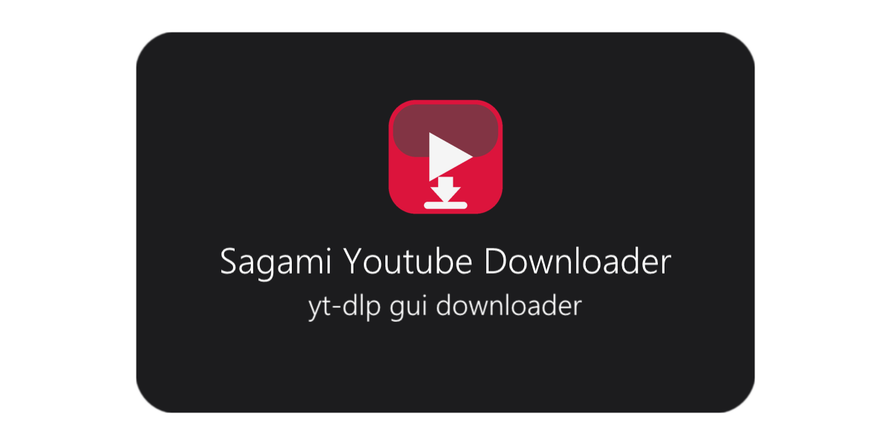

<p align="center">
  
  <br>
</p>

<p align="center">
  <a href="https://github.com/sagami121/Sagami-Youtube-Downloader/releases/latest" style="text-decoration: none;">
    
  </a>
  <a href="https://github.com/sagami121/Sagami-Youtube-Downloader/releases/latest" style="text-decoration: none;">
    
  </a>
  <a href="https://github.com/sagami121/Sagami-Youtube-Downloader/releases" style="text-decoration: none;">
    
  </a>
</p>

## 主な機能

- **マルチフォーマット対応**: MP4 (動画), MP3 / WAV / M4A (音声) への変換が可能。
- **高品質ダウンロード**: 最大 4K 解像度、60fps まで対応。
- **プレイリスト/チャンネル保存**: 一括ダウンロードや、個別の動画選択が可能。
- **時間指定ダウンロード (トリミング)**: 動画の特定の範囲（開始~終了）だけを保存。
- **ダウンロード履歴**: 過去にダウンロードした動画を一覧表示し、再アクセスや確認が可能。
- **ダーク / ライトモード**: OS の設定や好みに合わせてテーマを切り替え。切り替え時にはスムーズなアニメーションを搭載。
- **マルチ言語サポート**: 日本語、英語、韓国語、中国語 (簡体字) に対応。
- **ミニ UI モード**: デスクトップを邪魔しないコンパクトな表示。

## 使い方

1. **URL を入力**: YouTube の動画またはプレイリストの URL を入力欄に貼り付けます。
2. **保存先を選択**: 「保存先」ボタンからフォルダを指定します。
3. **品質・形式を設定**:
   - **Video**: 画質 (1080p, 720p 等) と FPS を選択。
   - **Audio**: 音質 (最高, 128kbps 等) を選択。
4. **詳細設定 (オプション)**:
   - 「詳細設定」から、サムネイルの埋め込み、字幕の追加、ファイル名テンプレートの設定が可能です。
   - クッキー設定やプロキシ設定もここで行えます。
5. **ダウンロード開始**: 「ダウンロードを開始」をクリック。

## システム要件
- **OS**: Windows 10/11 (推奨), macOS, Linux 

## ビルド方法
Nuitka を使用して、ビルドすることを推奨します。

### 事前準備
- Python 3.10+ (3.13 推奨)
- [Visual Studio C++ Build Tools (MSVC)](https://visualstudio.microsoft.com/visual-cpp-build-tools/)
- 依存パッケージのインストール:
  ```bash
  pip install -r requirements.txt
  pip install nuitka
  ```

### ビルド実行 (Windows)
```powershell
python -m nuitka --standalone --disable-cache=all --assume-yes-for-downloads --enable-plugin=pyside6 --windows-console-mode=disable --windows-icon-from-ico="Sagami Youtube Downloader.ico" --output-dir="nuitka_dist" --output-filename="Sagami Youtube Downloader.exe" --include-data-file="Sagami Youtube Downloader.ico=Sagami Youtube Downloader.ico" --include-data-file=yt-dlp.exe=yt-dlp.exe --include-data-file=ffmpeg.exe=ffmpeg.exe --include-data-file=ffprobe.exe=ffprobe.exe --include-data-dir=language=language --include-data-dir=theme=theme main.py
```

## ログとバグ報告

- エラー発生時は `logs` フォルダに詳細なログ (`app.log`) が自動生成されます。
- 不具合報告機能を通じて、エラー内容を送信できます（個人情報は収集されません）。

## ライセンス

このプロジェクトは [MIT License](LICENSE) の下で公開されています。
